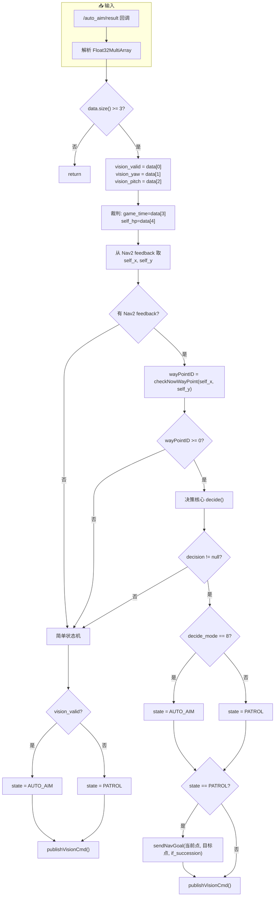
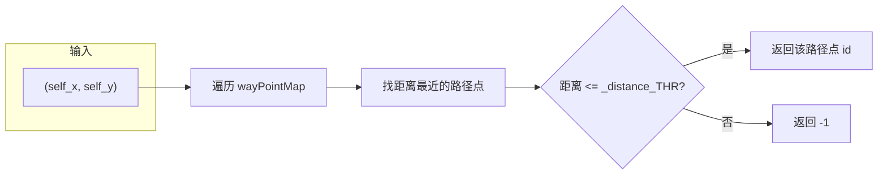
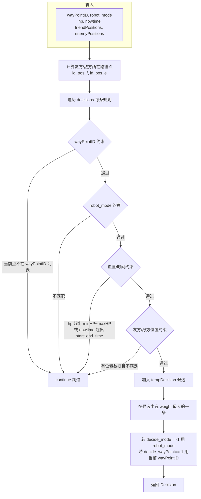
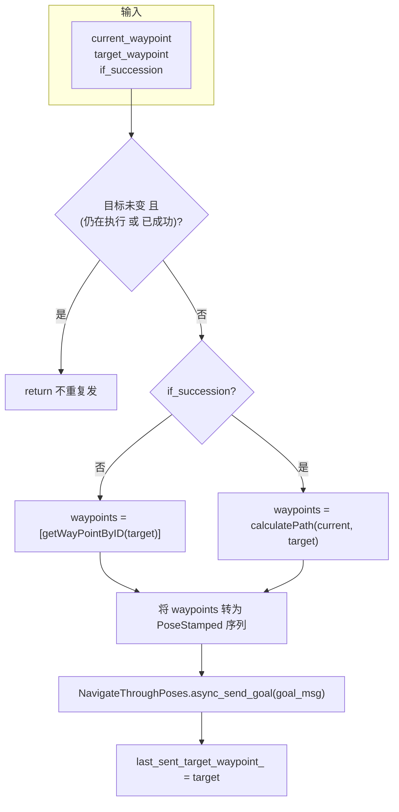
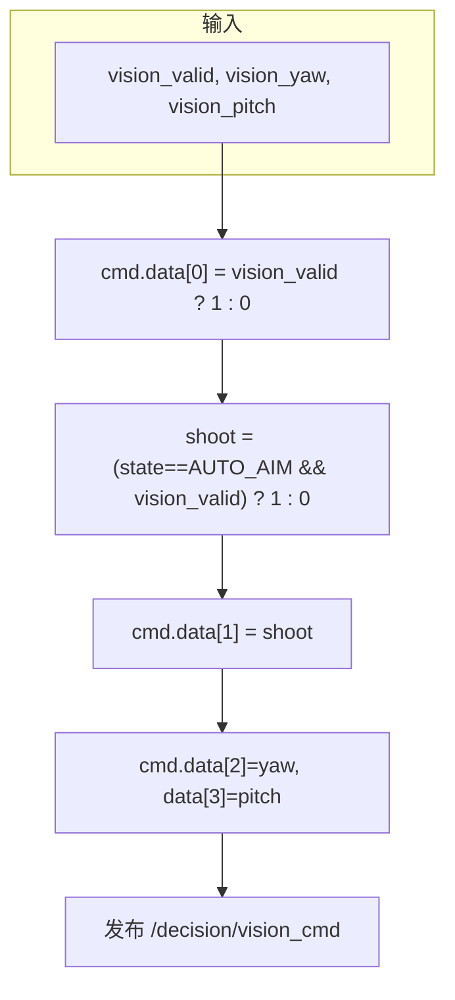
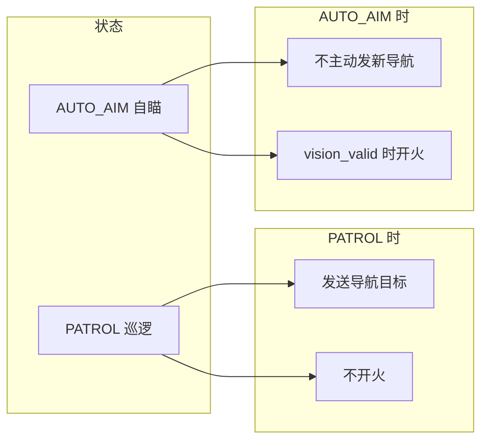

# 决策逻辑流程图

## 主流程：从订阅到输出

```mermaid
flowchart TB
    subgraph 输入["📥 输入"]
        A["/auto_aim/result 回调"]
        A --> B["解析 Float32MultiArray"]
    end

    B --> C{"data.size() >= 3?"}
    C -->|否| EXIT1["return"]
    C -->|是| D["vision_valid = data[0]\nvision_yaw = data[1]\nvision_pitch = data[2]"]
    D --> E["裁判: game_time=data[3]\nself_hp=data[4]"]
    E --> F["从 Nav2 feedback 取\nself_x, self_y"]

    F --> G{"有 Nav2 feedback?"}
    G -->|否| SM["简单状态机"]
    G -->|是| H["wayPointID = checkNowWayPoint(self_x, self_y)"]

    H --> I{"wayPointID >= 0?"}
    I -->|否| SM
    I -->|是| DEC["决策核心 decide()"]

    DEC --> J{"decision != null?"}
    J -->|否| SM
    J -->|是| K{"decide_mode == 8?"}
    K -->|是| STATE_A["state = AUTO_AIM"]
    K -->|否| STATE_P["state = PATROL"]

    STATE_A --> NAV_CHECK
    STATE_P --> NAV_CHECK{"state == PATROL?"}
    NAV_CHECK -->|是| NAV["sendNavGoal(当前点, 目标点, if_succession)"]
    NAV_CHECK -->|否| VISION
    NAV --> VISION["publishVisionCmd()"]

    SM --> SM_LOGIC{"vision_valid?"}
    SM_LOGIC -->|是| STATE_A2["state = AUTO_AIM"]
    SM_LOGIC -->|否| STATE_P2["state = PATROL"]
    STATE_A2 --> VISION2["publishVisionCmd()"]
    STATE_P2 --> VISION2
```

## 当前路径点判定 (checkNowWayPoint)

```mermaid
flowchart LR
    subgraph 输入点["输入"]
        P["(self_x, self_y)"]
    end
    P --> Q["遍历 wayPointMap"]
    Q --> R["找距离最近的路径点"]
    R --> S{"距离 <= _distance_THR?"}
    S -->|是| T["返回该路径点 id"]
    S -->|否| U["返回 -1"]
```

## 决策核心 decide() 规则筛选

```mermaid
flowchart TB
    subgraph 输入["输入"]
        W["wayPointID, robot_mode\nhp, nowtime\nfriendPositions, enemyPositions"]
    end

    W --> A["计算友方/敌方所在路径点\nid_pos_f, id_pos_e"]
    A --> B["遍历 decisions 每条规则"]

    B --> C1{"wayPointID 约束"}
    C1 -->|当前点不在 wayPointID 列表| REJECT["continue 跳过"]
    C1 -->|通过| C2{"robot_mode 约束"}
    C2 -->|不匹配| REJECT
    C2 -->|通过| C3{"血量/时间约束"}
    C3 -->|hp 超出 minHP~maxHP\n或 nowtime 超出 start~end_time| REJECT
    C3 -->|通过| C4{"友方/敌方位置约束"}
    C4 -->|有位置数据且不满足| REJECT
    C4 -->|通过| PASS["加入 tempDecision 候选"]

    PASS --> D["在候选中选 weight 最大的一条"]
    D --> E["若 decide_mode==-1 用 robot_mode\n若 decide_wayPoint==-1 用当前 wayPointID"]
    E --> OUT["返回 Decision"]
```

## 发送导航目标 sendNavGoal

```mermaid
flowchart TB
    subgraph 输入["输入"]
        IN["current_waypoint\ntarget_waypoint\nif_succession"]
    end

    IN --> A{"目标未变 且\n(仍在执行 或 已成功)?"}
    A -->|是| SKIP["return 不重复发"]
    A -->|否| B{"if_succession?"}
    B -->|否| C["waypoints = [getWayPointByID(target)]"]
    B -->|是| D["waypoints = calculatePath(current, target)"]
    C --> E["将 waypoints 转为 PoseStamped 序列"]
    D --> E
    E --> F["NavigateThroughPoses.async_send_goal(goal_msg)"]
    F --> G["last_sent_target_waypoint_ = target"]
```

## 云台指令 publishVisionCmd

```mermaid
flowchart TB
    subgraph 输入["输入"]
        I["vision_valid, vision_yaw, vision_pitch"]
    end
    I --> A["cmd.data[0] = vision_valid ? 1 : 0"]
    A --> B["shoot = (state==AUTO_AIM && vision_valid) ? 1 : 0"]
    B --> C["cmd.data[1] = shoot"]
    C --> D["cmd.data[2]=yaw, data[3]=pitch"]
    D --> E["发布 /decision/vision_cmd"]
```

## 状态与行为对照

```mermaid
flowchart LR
    subgraph 状态["状态"]
        PATROL["PATROL 巡逻"]
        AUTO["AUTO_AIM 自瞄"]
    end
    subgraph PATROL行为["PATROL 时"]
        P1["发送导航目标"]
        P2["不开火"]
    end
    subgraph AUTO行为["AUTO_AIM 时"]
        A1["不主动发新导航"]
        A2["vision_valid 时开火"]
    end
    PATROL --> P1
    PATROL --> P2
    AUTO --> A1
    AUTO --> A2
```
